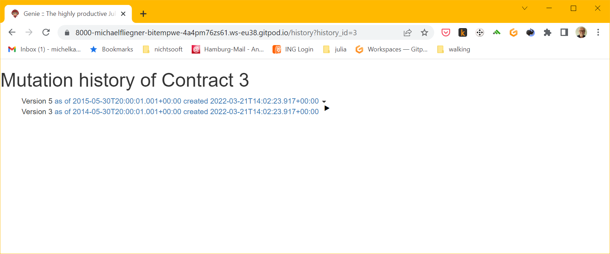
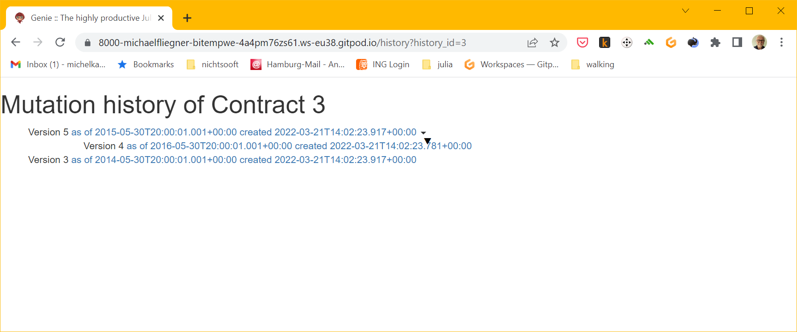

This is meant to become a prototype of a bitemporal data management system for life insurance. For theoretical background and generic aspects of the model look at the project for its persistence kernel https://github.com/michaelfliegner/BitemporalPostgres.jl.

We start with a structure only model without domain specific attributes, for a beginning concentrating on editing (using the API for now) and displaying the bitemporal model. The aim is to eventually
* include a tariff calculator based on examples from https://github.com/JuliaActuary/LifeContingencies.jl and to
* provide a reactive GUI based on Stipple: https://github.com/GenieFramework/Stipple.jl 
* Protypically provide complete workflows for managing life insurance contracts.

# Screenshots
For the script populating the database for these pages [see: test/testsCreateContract.jl]( test/testsCreateContract.jl)

History page unfolded, showing also shadowed, i.e. retrospectively corrected versions
b

