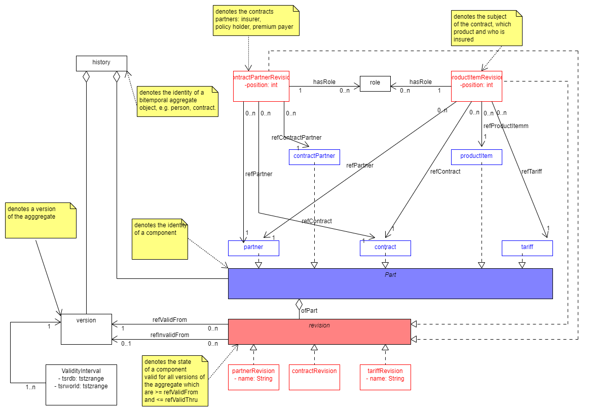

This is meant to become a prototype of a bitemporal data management system for life insurance. We start with a structure only model without domain specific attributes, for a beginning concentrating on editing (using the API for now) and displaying the bitemporal model.

# Screenshots
For the script populating the database for these pages [see: test/test.jl]( test/tests.jl)

History page showing also shadowed, i.e. retrospectively corrected versions

For theoretical background and generic aspects of the model look at the project for its persistence kernel

https://github.com/michaelfliegner/BitemporalPostgres.jl
